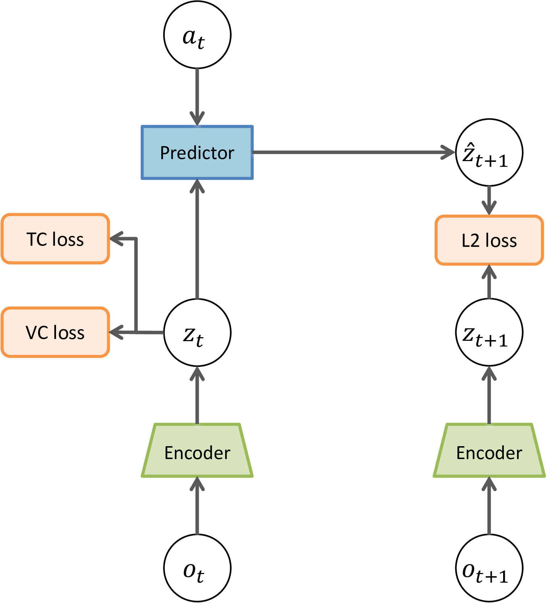
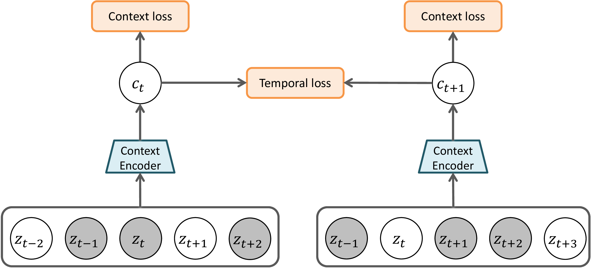

# Temporal Context Regularization for Latent World Models

Official implementation of **Temporal Context Regularization**, an auxiliary training objective for JEPA-based latent world models.

This codebase builds upon [PLDM (Planning with Latent Dynamics Models)](https://github.com/vladisai/PLDM) by Sobal et al.

## Motivation

PLDM learns latent representations through a purely unidirectional objective: predict the next state from the current state and action. While sufficient for one-step prediction, this leaves the latent space underspecified for multi-step planning. In offline settings, complete trajectories are available during training, but this bidirectional temporal information is entirely unexploited by the standard PLDM objective.

Temporal Context Regularization addresses this gap by introducing an auxiliary objective that enriches the encoder's representations with bidirectional temporal context. The objective operates entirely in the latent space and is discarded at inference time, adding no computational overhead.

## Method

<p align="center">
  
</p>
<p align="center"><em>Overall architecture. The architecture is identical to PLDM, except for the temporal and context losses (TC loss, left) detailed in the figure below.</em></p>

1. **Sliding Window Construction**: For each time-step $t$, a local context window $W\_t = [z\_{t-k}, \ldots, z\_t, \ldots, z\_{t+k}]$ of size $2k+1$ is extracted from the encoder's latent outputs.

1. **Masked Prediction via Context Transformer** (`pldm/models/context_projectors.py`): The center state $z\_t$ is replaced with a learnable mask token, and surrounding positions are randomly masked with probability $p\_{\text{mask}}$. A lightweight Transformer encoder processes the masked window and predicts the center representation.

1. **Training Objective** (`pldm/objectives/contextemb.py`): Two complementary losses are used:
   - **Context Reconstruction Loss**: MSE between the predicted and actual (stop-gradient) center state, both $\ell\_2$-normalized.
   - **Temporal Consistency Loss**: A hinge loss penalizing excessive deviation between consecutive context predictions $c\_t$ and $c\_{t+1}$.

   <p align="center">
     
   </p>
   <p align="center"><em>Context Encoder detail. Sliding windows of latent states are fed to the Context Encoder with the center state masked. The context reconstruction loss supervises each window's prediction, while the temporal consistency loss constrains consecutive predictions to stay close.</em></p>

1. **Integration**: The total loss is $\mathcal{L}\_{\text{total}} = \mathcal{L}\_{\text{PLDM}} + \alpha \mathcal{L}\_{\text{context}} + \beta \mathcal{L}\_{\text{temporal}}$. At inference time, the Context Transformer is discarded entirely, so planning proceeds with no additional overhead. Experiment configurations are in `pldm/configs/wall/context/`.

## Key Results (Two-Room Environment)

Success rates (%) on the Two-Room navigation task. PLDM results are from our re-implementation using the [official codebase](https://github.com/vladisai/PLDM).

| Setting              | PLDM (re-impl.) | PLDM-TC (Ours) |
| -------------------- | --------------- | -------------- |
| Sequence length T=17 | 84.6 ± 3.7      | **87.7 ± 2.9** |
| Sequence length T=33 | 92.5 ± 2.8      | **94.9 ± 2.3** |
| Sequence length T=65 | 82.1 ± 7.3      | **91.3 ± 7.9** |
| Sequence length T=91 | **96.8 ± 2.5**  | 96.6 ± 3.8     |
| Dataset size 81K     | 85.3 ± 6.9      | **89.7 ± 4.6** |
| Dataset size 325K    | 91.3 ± 6.1      | **98.5 ± 0.9** |

The proposed method shows consistent improvements, particularly in shorter sequence lengths and at larger dataset scales.

## Setup

```bash
git clone https://github.com/swsvv/temporal-context-wm.git
cd temporal-context-wm

pip install -r requirements.txt
pip install -e .
```

## Training

### PLDM + Temporal Context Regularization (Two-Room, T=17)

```bash
python -m pldm.train \
  --configs pldm/configs/wall/context/seqlen17_3M_modified.yaml \
  --values \
    data.offline_wall_config.offline_data_path=/path/to/wall/presaved_datasets/len_17.npz \
    output_root=/path/to/checkpoints \
    output_dir=pldm_tc_seqlen17
```

### PLDM Baseline (Two-Room, T=17)

```bash
python -m pldm.train \
  --configs pldm/configs/wall/icml/seqlen17_3M.yaml \
  --values \
    data.offline_wall_config.offline_data_path=/path/to/wall/presaved_datasets/len_17.npz \
    output_root=/path/to/checkpoints \
    output_dir=pldm_baseline_seqlen17
```

## Datasets

Follow the dataset setup instructions in `pldm_envs/wall/` for the Two-Room environment. The dataset generation scripts and download links are provided in the [PLDM repository](https://github.com/vladisai/PLDM).

## Evaluation

To evaluate a trained checkpoint:

```bash
python -m pldm.train \
  --configs pldm/configs/wall/context/seqlen17_3M_modified.yaml \
  --values \
    eval_only=true \
    load_checkpoint_path=/path/to/checkpoint.ckpt \
    output_root=/path/to/eval_output \
    output_dir=eval_pldm_tc
```

## Citation

If you find this code useful, please cite:

```bibtex
@phdthesis{seo2026temporal,
  title={Regularizing Latent Representations and Dynamics: Self-Supervision, Temporal Context, and Causal Consistency},
  author={Seo, Sungwon},
  year={2026},
  school={Korea University},
  advisor={Kim, Jong-Kook}
}
```

Please also cite the original PLDM paper:

```bibtex
@article{sobal2026learning,
  title={Learning from reward-free offline data: A case for planning with latent dynamics models},
  author={Sobal, Uladzislau and Zhang, Wancong and Cho, Kyunghyun and Balestriero, Randall and Rudner, Tim GJ and LeCun, Yann},
  journal={Advances in Neural Information Processing Systems},
  volume={38},
  pages={43905--43941},
  year={2026}
}
```

## Acknowledgements

This codebase is built upon [PLDM](https://github.com/vladisai/PLDM) by Sobal et al. We thank the authors for making their code publicly available under the MIT License.
